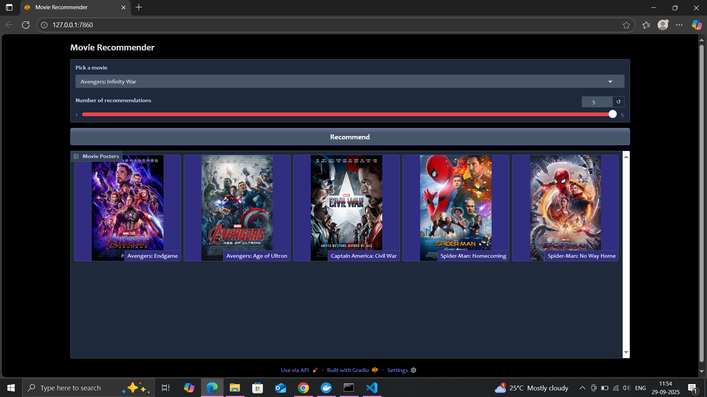
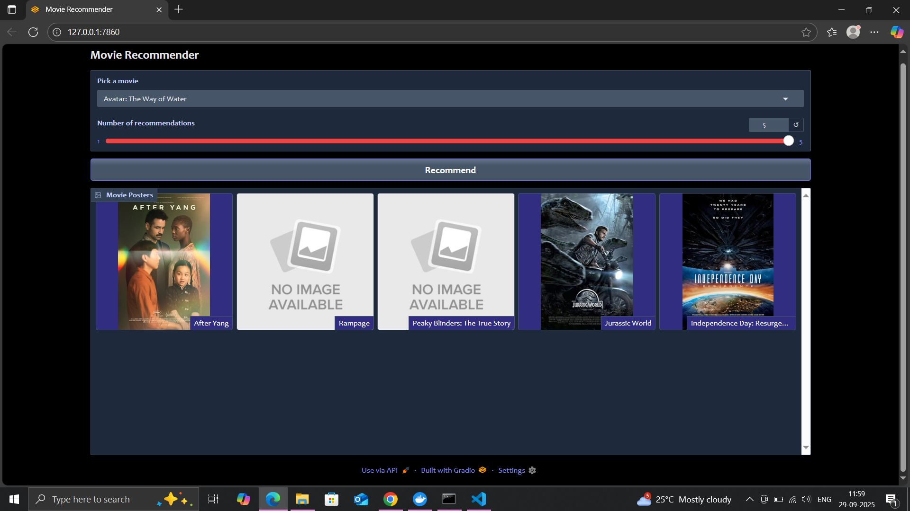
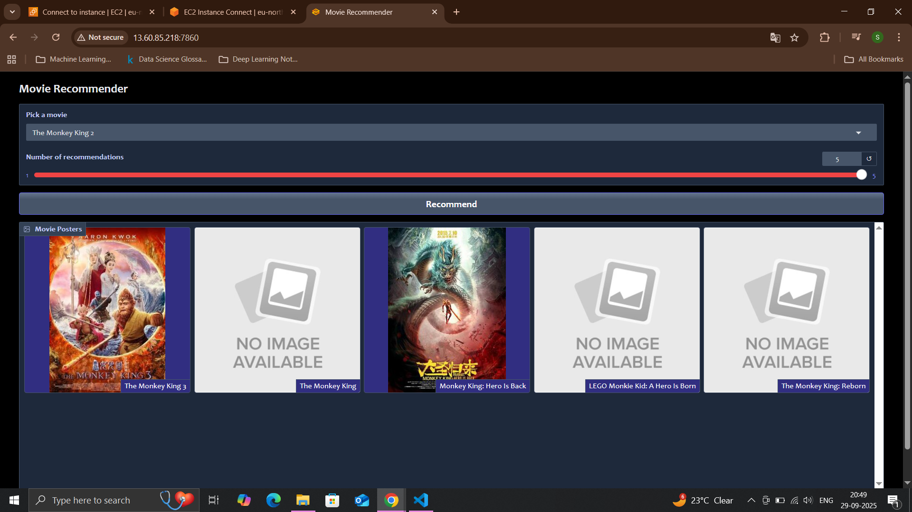
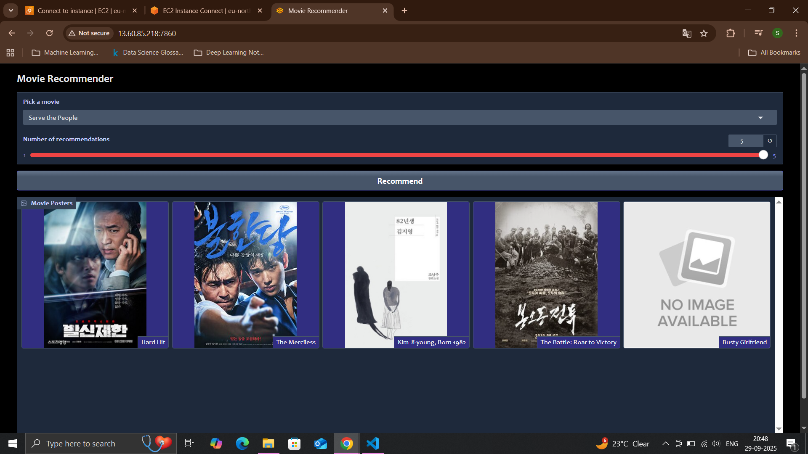

# movie_recommedation 

### first Example pic of Recommend photo on Local System


### Second Example pic of Recommend photo local system


### Third Example pic of Recommend photo AWS instance ec2 system 


### Fourth Example pic of Recommend photo AWS instance ec2 system 



### Create and activate a virtual environment
```
conda create -p rec_venv python==3.12 -y

conda activate rec_venv/

```
### install dependencies
```
pip install -r requirements.txt

```
### Git commands

```
1. git init

2. git add .  or git add README.md notebook text files

3. git commit -m "first commit"

4. git remote remove origin

5. git remote add origin https://github.com/shivarajshelar/movie_data_recommedation.git

6. git remote -v

7. git branch -M main

8. git push -u origin main 

```
## Tech & Skills are used for this project

1. Pandas
2. Numpy
3. scikit-learn
4. Gradio
5. Docker 
6. AWS EC2 instance


##  Dockerize command file and Push to docker from Local system
```
docker build -t mass19/movie_sub .

docker run -p 7860:7860 mass19/movie_sug

docker push mass19/movie_sug:lastest

local machine address --> http://127.0.0.1:7860

```

## AWS EC2 Command to install docker 

```
Create EC2 instance 

Connect to intance

sudo apt-get update 

sudo apt-get install -y docker.io

sudo systemctl start docker 

sudo systemctl enable docker 

sudo usermode -aG docker $USER  -- give the permission to ec2 for the pull docker images

exit

Restart Connection

docker pull mass19/movie_sug:latest

docker run -p 7860:7860 mass19/movie_sug

http://13.60.85.218:7860/   this is aws ec2 public ip address

```

## How It Works

Feature engineering & NLP: Combined title + overview + genre + cast into a single text field; vectorized with CountVectorizer (max_features=3000, stop_words='english') and computed cosine similarity for recommendations.

Data pipeline: Handled nulls/dupes, extracted year from dates, filtered to 2014–2022, and exported curated dataset.

App UX: Built an interactive Gradio app (dropdown + slider for k) that returns posters & titles; scraped poster URLs via Requests + BeautifulSoup (Wikipedia fallback image handling).

Production readiness: Packaged with Docker and (optionally) deployed on AWS EC2; added .gitignore and artifact strategy to keep the repo lightweight.