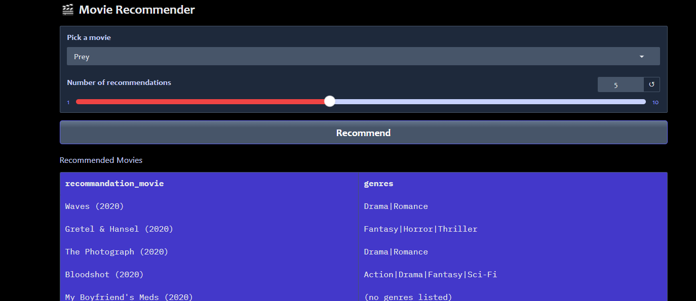
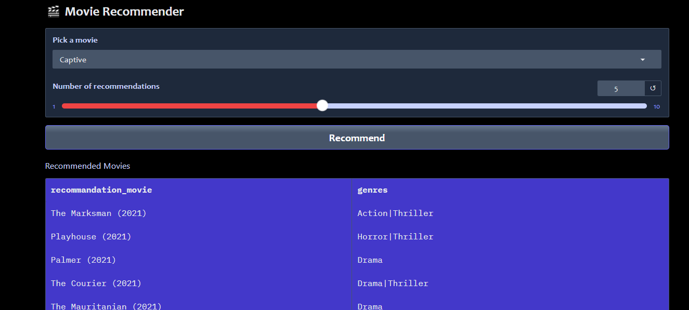
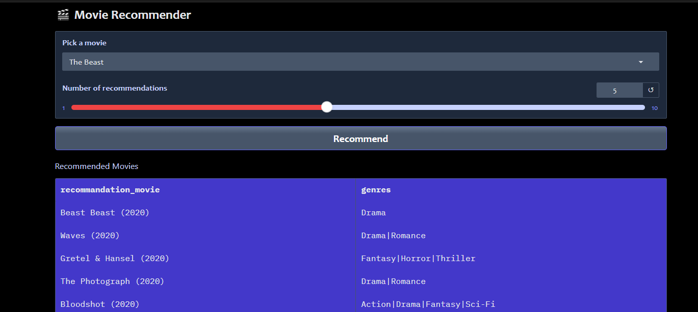

# movie_recommedation 

### first Example pic of Recommend photo


### Second Example pic of Recommend photo


### Third Example pic of Recommend photo



### Create and activate a virtual environment
```
conda create -p rec_venv python==3.12 -y

conda activate rec_venv/

```
### install dependencies
```
pip install -r requirements.txt

```
### Git commands

```
1. git init

2. git add .  or git add README.md notebook text files

3. git commit -m "first commit"

4. git remote remove origin

5. git add origin https://github.com/shivarajshelar/movie_data_recommedation.git

6. git remote -v

7. git branch -M main

8. git push -u origin

```
## Library are used for this project

1. Pandas
2. Numpy
3. scikit-learn
4. Gradio


## How it works

First, the **CountVectorizer** method is applied to convert the text data (such as genres, keywords, or movie descriptions) into a numerical format. This creates a "bag of words" representation where each movie is stored as a vector of word counts.  

Next, **cosine similarity** is used to measure how close or similar two movies are based on their text vectors. Movies with higher similarity scores share more common features in their descriptions.  

Finally, for any given movie, the system compares it with all other movies and returns the **top 5 most similar movies** as recommendations.

